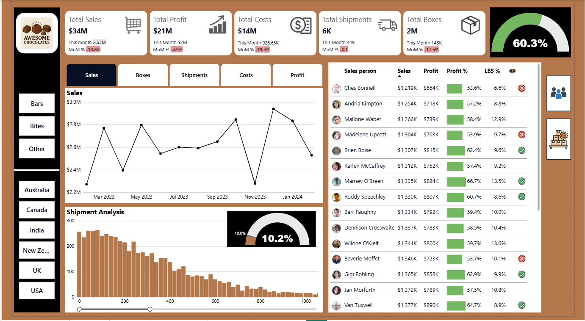

# Sales Analytics Dashboard (Power BI Project)📊
This project provides an interactive Power BI dashboard to track KPIs including total sales, profits, shipments, costs, and Product/Salesperson performance across various geographic regions for a chocolate business known as Awesome Chocolates🍫.

## Business Problem
The business lacked a centralised view of sales performance, profitability, and shipment efficiency across products, regions, and sales teams. The reporting was fragmented, making it difficult to:

- Identify high-margin products and underperformers.
-	Monitor shipment inefficiencies such as Low Box Shipment (LBS). 
-	Track month-on-month performance trends.
-	Enable fast, data-driven decision-making.

#### Objective:
To analyse sales data to develop a data-driven solution to diagnose performance drivers, uncover inefficiencies, and support strategic decision-making across sales and operations.

## Approach
#### 1. Data Extraction & Preparation
-	Extracted raw sales, product, geography, and salesperson data using SQL.
-	Performed joins across multiple tables to create a unified dataset.
-	Cleaned and transformed data using Power Query (handling missing values, data types, and calculated columns (e.g. Amount per Box)).

#### 2. Data Modelling
**Designed a star schema:**
- Central table / Fact Table: Shipments 
- Dimension Tables: Products, Salesperson, Geography, Calendar/Data
- Established relationships to enable cross-filtering and drill-down analysis.

#### 3. KPI Development (DAX)
**Developed key business metrics:**
-	“Total Sales, Profit, Costs, Shipments, Boxes” 
-	“Profit % = Profit / Sales” 
-	“MoM Growth %” 
-	“LBS % (Low Box Shipment indicator)” 
-	Shipment Volume Distribution 

#### 4. Dashboard Development 
- **Top KPI cards** for executive overview show Total Sales, Profit, Costs, Shipments, Boxes, and LBS % with monthly growth indicators.
- **Line chart** visualize trends over time (sales, boxes, shipments, costs, profit).
- **Gauge chart** depict shipment volume distribution and overall performance (10% LBS gauge).
- **Tabular view** details sales, profit, profit%, and LBS % for salespeople and products, with icons marking top/under performers.
- **Slicers/buttons** allow real time filtering by category (Bars, Bites, Other),geography (Australia, Canada, India, NZ, UK, USA), and Salesperson/Products.

## Technology Stack 💻  
- Power BI (Desktop and service)
- Database (MySQL)  
- MS Excel (Data Cleaning & Transformation)  
- DAX (KPI Measures)  
- Power Query (Data processing / Data Modeling)

## Key Project Insights
#### 1. Product Profitability Insight:
-	Peanut Butter Cubes generated the highest profit margin, significantly above category average. 
-	Indicates strong pricing power and demand adaptability.
-	Opportunity: Scale distribution and prioritise inventory allocation. 

#### 2. Underperforming Product Detection:
-	Baker’s Choco Chips showed low profitability and high LBS%. 
-	Indicates inefficient shipment sizes and poor margin structure. 
-	Risk: Continued sales may reduce overall profitability.

#### 3. Shipment Efficiency (LBS Analysis):
-	LBS consistently exceeded the 10% threshold, indicating operational inefficiencies. 
-	Higher LBS → smaller shipment sizes → increased logistics cost per unit. 
-	Opportunity: Optimise packaging or consolidate shipments. 

#### 4. Salesperson Performance Variance:
-	Significant variation in profit % and LBS across sales reps. 
-	Top performers maintained high margins with efficient shipments. 
-	Underperformers showed poor shipment efficiency and lower profitability.

## Recommendations 💡 
 #### 1. Scale high-margin products:
- Increase distribution and marketing for top-performing SKUs to maximise profitability.
- **Risk Mitigation**: Pilot 3-month test in high-volume regions (USA, Canada) before full rollout.

#### 2.	Fix or remove low performers:
- Re-evaluate pricing, promotions, or discontinue low-margin products if margins cannot be improved. 

#### 3. Optimise shipment strategy:
Reduce LBS by:
-	Increasing average shipment size. 
-	Improving demand forecasting. 
-	Consolidating logistics operations.

#### 4.	Sales team optimisation:
- Use salesperson performance insights to train underperforming sales reps and replicate top performer strategies. Align incentives with profitability and shipment efficiency 

## Business Impact
**This dashboard enables:**	
-	Improved visibility into key performance drivers (sales, profit, shipment efficiency).
-	Enabled faster decision-making through automated dashboards (20% reduction in manual reporting effort).
-	Identified revenue growth opportunities via product-level analysis. 
-	Reduction of operational inefficiencies by monitoring shipment trends. 
-	Improved sales performance through targeted interventions.

## Future Improvements
-	Integrate real-time data sources for live tracking. 
-	Add predictive modeling for demand forecasting. 
-	Incorporate customer segmentation for deeper insights.

## To explore the project:
- Open the .pbix file in Power BI Desktop.
- Use slicers to filter the data.
- Inspect DAX measures to view KPI logic.

### Dashboard Overview:

